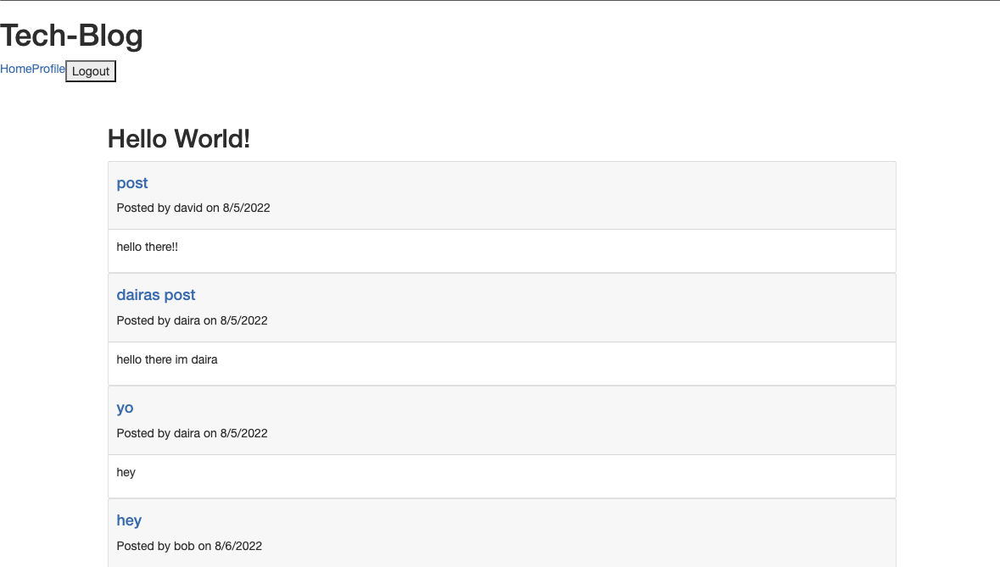
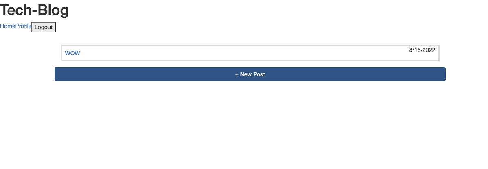

## Tech-Blog-MVC


## Description
this applicatoin uses the MVC file structure that includes a back end using mySQL and Sequelize and a front end that uses Javascript and Handlebars. This application allows the user to sign in or sign up as a new user. MySQL is used to store sign in and sign up data which allows the user to sign in using credentials from when they signed up. Upon signing in users are able to create a post and if signed out the post is stored in a database that the user can access after signing out.  

## Technologies
* Javascript
* Node.js
* MySQL
* Sequelize
* Handlebars

## Installation
must have node.js and mySQL installed. Type in `npm i` in the terminal. 
```mysql -u root -p```
type in your mysql password
```SOURCE ./db/schema.sql```
```npm run seed```
```npm run start```
## Usage
To use the application you must create an account or sign in. once signed in, you can create posts or comment on other users posts. Upon signing out any posts or comments you have made will be stored in a database so if you log in at a different time, you will still have access to your posts. 

##  Preview
[Deployed Heroku app](https://tech-blog-david.herokuapp.com/)




## Author
- GitHub: davidpascual2
- Email: davidpascual200@gmail.com